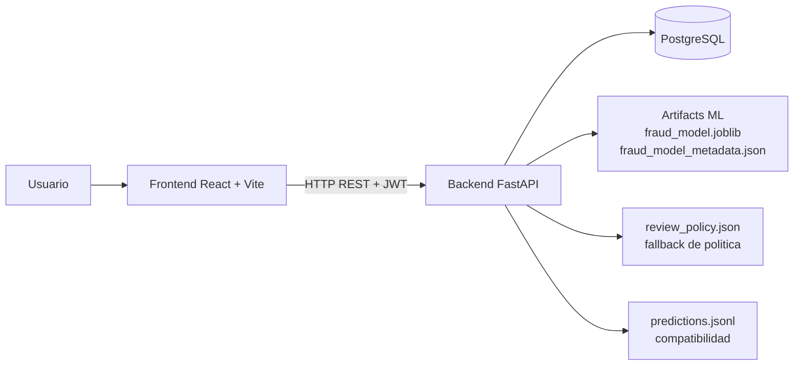

# Arquitectura de Fraud Watch

## 1. Vision general

Fraud Watch es una aplicacion cliente-servidor para deteccion de fraude con Machine Learning.
Su objetivo es ofrecer una operacion analitica trazable con:

- scoring individual y batch,
- gestion de politica de revision,
- historicos operativos,
- analitica visual,
- generacion y descarga de informes,
- autenticacion JWT con roles basicos.

Componentes:

- `frontend/`: React + Vite (UI operativa y autenticada).
- `backend/`: FastAPI (API, logica de negocio, auth, persistencia, integracion ML).
- `postgres`: almacenamiento relacional de estado operativo e historico.
- `artifacts`: modelo y metadata de ML.

## 2. Arquitectura cliente-servidor

```text
Usuario
  -> Frontend React/Vite
  -> Backend FastAPI
  -> PostgreSQL + Artifacts ML + politica fallback
  -> Respuesta JSON/CSV al frontend
```

## 3. Diagrama de alto nivel



## 4. Frontend (React/Vite)

### 4.1 Estructura principal

- `src/pages`: pantallas (`/login`, `/register`, `/dashboard`, `/analysis`, `/reports`, `/config`)
- `src/components`: layout, UI, charts y componentes de dominio
- `src/services/api.js`: cliente HTTP centralizado
- `src/context/AuthContext.jsx`: sesion y estado de autenticacion
- `src/utils`: adapters y formatters
- `src/data/mockData.js`: fallback visual

### 4.2 Navegacion y proteccion de rutas

- Rutas publicas: `/`, `/login`, `/register`
- Rutas protegidas: `/dashboard`, `/analysis`, `/reports`, `/config`
- Si no hay sesion valida, se redirige a `/login`.

### 4.3 Integracion por rol en UI

- En `ConfigPage`, usuarios `analyst` pueden consultar politica/historico.
- Solo usuarios `admin` pueden editar/guardar politica desde UI.
- El backend refuerza esta regla en `PUT /policy`.

## 5. Backend (FastAPI)

### 5.1 Capas

- `api/app.py`: exposicion de endpoints y serializacion de respuestas
- `core/config.py`: variables de entorno y paths
- `db/`: engine, SessionLocal y modelos SQLAlchemy
- `repositories/`: consultas DB por entidad
- `services/`: logica de negocio y orquestacion
- `schemas/`: modelos Pydantic de entrada/salida

### 5.2 Endpoints funcionales (resumen)

- Salud: `GET /health`
- Auth:
  - `POST /auth/register`
  - `POST /auth/login`
  - `GET /auth/me`
- Politica:
  - `GET /policy`
  - `PUT /policy` (solo admin)
  - `GET /policy/history`
- Prediccion:
  - `POST /predict`
  - `POST /predict_batch`
- Batch CSV y consultas:
  - `POST /batch-jobs/upload`
  - `GET /batch-jobs`
  - `GET /batch-jobs/{id}`
  - `GET /batch-jobs/{id}/predictions`
  - `GET /batch-jobs/{id}/download`
- Predicciones:
  - `GET /predictions`
  - `GET /predictions/{id}`
- Dashboard:
  - `GET /dashboard/summary`
  - `GET /dashboard/priority-cases`
- Analytics:
  - `GET /analytics/fraud-evolution`
  - `GET /analytics/risk-distribution`
  - `GET /analytics/classification-summary`
  - `GET /analytics/variable-importance`
- Informes:
  - `POST /reports`
  - `GET /reports`
  - `GET /reports/{id}`
  - `GET /reports/{id}/download`
- Soporte operativo:
  - `GET /audit-events`
  - `GET /model-versions`
  - `GET /model-versions/active`
  - `GET /drift-runs`

## 6. Flujo de autenticacion JWT

```text
Registro/Login
  -> backend valida credenciales
  -> backend genera JWT (sub=user.id)
  -> frontend guarda token + usuario
  -> frontend envia Authorization: Bearer <token>
  -> backend valida token en endpoints protegidos
```

Detalles:

- Hash de password: `passlib[bcrypt]`
- Token: `PyJWT` (HS256)
- Parametros en `.env`:
  - `JWT_SECRET_KEY`
  - `JWT_ALGORITHM`
  - `JWT_ACCESS_TOKEN_EXPIRE_MINUTES`

## 7. Flujo de registro/login

### Registro

1. Frontend envia email, full_name, password y role.
2. Backend valida formato y rol permitido (`analyst`/`admin`).
3. Backend crea usuario con password hasheada.
4. Backend devuelve token y perfil de usuario.

### Login

1. Frontend envia email/password.
2. Backend valida credenciales y estado activo.
3. Backend devuelve token JWT y perfil.

Nota academica:
- La eleccion de rol en registro esta habilitada para demostracion de TFG.
- En produccion, la asignacion de rol administrativo debe restringirse por proceso controlado.

## 8. Flujo de prediccion, clasificacion y revision

### Prediccion individual (`POST /predict`)

1. Se carga modelo (`fraud_model.joblib`) y columnas esperadas.
2. Se valida vector de entrada.
3. Se calcula `proba_fraud`.
4. Se aplica politica activa (`threshold_cost`) para marcar `review`.
5. Se persiste en `predictions` (best effort de auditoria/log complementario).

### Prediccion batch JSON (`POST /predict_batch`)

1. Se separan transacciones validas/invalidas por features.
2. Se scorean solo validas.
3. Se aplica `threshold_cost` y `max_alerts` para decidir revision y rank.
4. Se persiste `batch_job` + `predictions`.

### Upload CSV real (`POST /batch-jobs/upload`)

1. Se valida extension/content-type CSV.
2. Se parsea con pandas y se valida fila a fila.
3. Se scorean filas validas.
4. Se persiste batch y predicciones (validas e invalidas).
5. Se intenta crear `drift_run` automaticamente (best effort).
6. Se audita evento `BATCH_UPLOADED`.

## 9. Gestion de roles y autorizacion

Regla actual implementada:

- `PUT /policy`: requiere JWT valido y `role=admin`.
- Sin token: `401`
- Token invalido/expirado: `401`
- Rol distinto de admin: `403`

El resto de endpoints no tiene RBAC fino aun (fase futura).

## 10. Persistencia y modelo de datos

Tablas principales:

- `users`
- `model_versions`
- `policies`
- `policy_history`
- `batch_jobs`
- `predictions`
- `reports`
- `drift_runs`
- `audit_events`

Objetivo de persistencia:

- trazabilidad,
- historico operativo,
- auditoria,
- soporte de dashboard/analitica/informes.

## 11. Relacion con artefactos ML

Backend usa artefactos en `backend/artifacts/`:

- `fraud_model.joblib`
- `fraud_model_metadata.json`
- `ref_scores.npy` (para drift comparativo en upload CSV)

El backend no reentrena en runtime.
El scoring usa modelo serializado ya entrenado.

## 12. Configuracion de politica de revision

- Fuente principal: tabla `policies` (registro activo).
- Fallback: `backend/review_policy.json` en `GET /policy` si falla DB.
- Cambios de politica generan:
  - entrada en `policy_history`
  - evento de auditoria `POLICY_UPDATED`

## 13. Informes y descargas

- `POST /reports` genera informes reales en `backend/data/reports/`.
- Formatos soportados: `json`, `csv`.
- `GET /reports/{id}/download` entrega archivo segun formato del reporte.

## 14. Dockerizacion

Servicios en `docker-compose.yml`:

- `postgres` (PostgreSQL 16)
- `backend` (FastAPI)
- `frontend` (build Vite y servicio Nginx)

Flujo tipico:

```powershell
docker compose up -d postgres
docker compose run --rm backend alembic upgrade head
docker compose run --rm backend python scripts/init_db.py
docker compose up -d backend frontend
```

## 15. Testing y calidad

- Backend cubierto por `pytest` (`tests/test_api.py`, `tests/test_db.py`).
- Cobertura funcional incluye auth, policy, prediccion, dashboard, analytics, reports, drift y upload CSV.

## 16. Mejoras futuras recomendadas

1. Restringir asignacion de rol admin en registro para entornos no demo.
2. Añadir refresh tokens y gestion avanzada de sesion.
3. Aplicar RBAC granular en mas endpoints sensibles.
4. Endurecer configuracion productiva de secretos y observabilidad.
5. Mejorar documentacion de despliegue productivo y backups.
