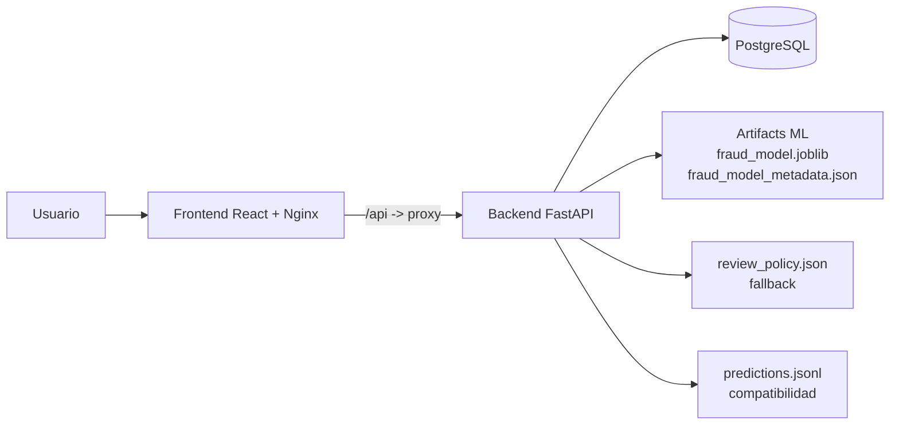

# Arquitectura de Fraud Watch

## 1. Vision general

Fraud Watch es una aplicacion cliente-servidor para deteccion de fraude con Machine Learning.
El sistema prioriza trazabilidad operativa y soporte analitico para revision de casos.

Capacidades principales:

- scoring individual y batch,
- gestion de politica de revision,
- historico operativo con auditoria,
- analitica visual y descarga de informes,
- autenticacion JWT con roles basicos.

Componentes funcionales:

- `frontend/`: React + Vite + Nginx (UI y proxy `/api` en despliegue).
- `backend/`: FastAPI + SQLAlchemy (API, auth, scoring, persistencia).
- `postgres`: almacenamiento transaccional (local o Azure Flexible Server).
- `backend/artifacts`: modelo entrenado y metadata.

## 2. Contextos de ejecucion

El proyecto tiene tres contextos de ejecucion que conviene separar:

1. Local de desarrollo
- `docker-compose.yml` con `postgres` local.
- frontend y backend para pruebas y desarrollo diario.

2. VM con Docker Compose (despliegue simple)
- `docker-compose.deploy.yml`.
- sin `postgres` local.
- backend conectado a Azure PostgreSQL Flexible Server por `DATABASE_URL`.

3. Kubernetes (opcion simple en repo)
- manifiestos en `k8s/despliegue/`.
- despliegue basado en `Deployment` + `Service LoadBalancer`.

## 3. Arquitectura de alto nivel

```text
Usuario (navegador)
  -> Frontend (React compilado servido por Nginx)
  -> /api (proxy Nginx)
  -> Backend FastAPI
  -> PostgreSQL + Artifacts ML + Politica fallback
  -> Respuesta JSON/CSV al frontend
```



## 4. Frontend (React/Vite)

### 4.1 Estructura principal

- `src/pages`: pantallas (`/login`, `/register`, `/dashboard`, `/analysis`, `/reports`, `/config`)
- `src/components`: layout, UI, charts y componentes de dominio
- `src/services/api.js`: cliente HTTP centralizado
- `src/context/AuthContext.jsx`: sesion y estado de autenticacion
- `src/utils`: adapters y formatters
- `src/data/mockData.js`: fallback visual

### 4.2 Navegacion y proteccion

- Rutas publicas: `/`, `/login`, `/register`.
- Rutas protegidas: `/dashboard`, `/analysis`, `/reports`, `/config`.
- Sin sesion valida: redireccion a `/login`.

### 4.3 Integracion API

- `BASE_URL` usa `VITE_API_URL` si existe.
- Si no existe, usa `/api` por defecto.
- En despliegue, Nginx del frontend enruta `/api` a `backend:8000`.

## 5. Backend (FastAPI)

### 5.1 Capas

- `api/app.py`: endpoints, serializacion y middleware.
- `core/config.py`: carga de entorno y paths.
- `db/`: engine, sesiones y modelos SQLAlchemy.
- `repositories/`: acceso a datos por agregado.
- `services/`: logica de negocio y orquestacion.
- `schemas/`: contratos Pydantic entrada/salida.

### 5.2 Endpoints funcionales (resumen)

- Salud: `GET /health`
- Auth: `POST /auth/register`, `POST /auth/login`, `GET /auth/me`
- Politica: `GET /policy`, `PUT /policy`, `GET /policy/history`
- Scoring: `POST /predict`, `POST /predict_batch`
- Batch CSV: `POST /batch-jobs/upload`, `GET /batch-jobs`, `GET /batch-jobs/{id}`, `GET /batch-jobs/{id}/predictions`, `GET /batch-jobs/{id}/download`
- Consultas: `GET /predictions`, `GET /predictions/{id}`
- Dashboard: `GET /dashboard/summary`, `GET /dashboard/priority-cases`
- Analytics: `GET /analytics/fraud-evolution`, `GET /analytics/risk-distribution`, `GET /analytics/classification-summary`, `GET /analytics/variable-importance`
- Informes: `POST /reports`, `GET /reports`, `GET /reports/{id}`, `GET /reports/{id}/download`
- Soporte operativo: `GET /audit-events`, `GET /model-versions`, `GET /model-versions/active`, `GET /drift-runs`

### 5.3 Configuracion runtime clave

- `DATABASE_URL`: conexion DB (en despliegue, Flexible Server con `sslmode=require`).
- `JWT_SECRET_KEY`, `JWT_ALGORITHM`, `JWT_ACCESS_TOKEN_EXPIRE_MINUTES`.
- `CORS_ALLOW_ORIGINS`: origenes permitidos.
- `ROOT_PATH`: prefijo si se publica backend bajo ruta (normalmente vacio).
- `MODEL_PATH`, `MODEL_METADATA_PATH`, `REVIEW_POLICY_PATH`, `PREDICTIONS_LOG_PATH`.

## 6. Flujo de autenticacion JWT

```text
Registro/Login
  -> backend valida credenciales
  -> backend genera JWT (sub=user.id)
  -> frontend guarda token + usuario
  -> frontend envia Authorization: Bearer <token>
  -> backend valida token en endpoints protegidos
```

Detalles:

- hash de password con `passlib[bcrypt]`,
- token firmado con `PyJWT` (`HS256`),
- control de rol activo en `PUT /policy` (admin).

## 7. Flujo de scoring y revision

### 7.1 Prediccion individual (`POST /predict`)

1. Carga de modelo y columnas esperadas.
2. Validacion de entrada.
3. Calculo de `proba_fraud`.
4. Aplicacion de politica (`threshold_cost`) para `review`.
5. Persistencia de prediccion y log de compatibilidad.

### 7.2 Prediccion batch JSON (`POST /predict_batch`)

1. Separacion de validas/invalidas.
2. Scoring de validas.
3. Aplicacion de `threshold_cost` y `max_alerts` con ranking.
4. Persistencia de `batch_job` y `predictions`.

### 7.3 Upload CSV (`POST /batch-jobs/upload`)

1. Validacion de archivo CSV.
2. Parseo y validacion por fila.
3. Scoring de filas validas.
4. Persistencia de job y resultados.
5. Intento best effort de calculo de drift.
6. Registro de evento de auditoria.

## 8. Persistencia y datos

Tablas principales:

- `users`
- `model_versions`
- `policies`
- `policy_history`
- `batch_jobs`
- `predictions`
- `reports`
- `drift_runs`
- `audit_events`

Compatibilidad por archivo:

- `review_policy.json` (fallback de politica),
- `logs/predictions.jsonl` (traza historica).

Artefactos ML en `backend/artifacts/`:

- `fraud_model.joblib`
- `fraud_model_metadata.json`
- `ref_scores.npy`

## 9. Vistas de despliegue

### 9.1 Local (`docker-compose.yml`)

Servicios:

- `postgres` local,
- `backend`,
- `frontend`.

Uso tipico:

```powershell
docker compose up -d postgres
docker compose run --rm backend alembic upgrade head
docker compose run --rm backend python scripts/init_db.py
docker compose up -d backend frontend
```

### 9.2 VM (`docker-compose.deploy.yml`)

Servicios:

- `backend`,
- `frontend`,
- `db-init` (profile `init` para migraciones/seed).

Caracteristicas:

- no se levanta `postgres` local,
- `DATABASE_URL` apunta a Azure PostgreSQL Flexible Server,
- frontend publicado en `:80`.

Uso tipico:

```powershell
docker compose -f docker-compose.deploy.yml --profile init up db-init
docker compose -f docker-compose.deploy.yml up -d --build
```

### 9.3 Kubernetes simple (`k8s/despliegue`)

Manifiestos disponibles:

- `namespace.yaml`
- `microdeployment.yaml`
- `microservice.yaml`
- `microfront-deployment.yaml`
- `microfront-service.yaml`

## 10. Roles y autorizacion

Regla de autorizacion actualmente activa:

- `PUT /policy` requiere JWT valido y `role=admin`.

Respuestas esperadas:

- sin token: `401`,
- token invalido/expirado: `401`,
- rol no admin: `403`.

Nota de alcance:

- el resto de endpoints no tiene RBAC fino todavia.

## 11. Informes y descargas

- `POST /reports` genera informes en `backend/data/reports/`.
- formatos soportados: `json`, `csv`.
- descarga por `GET /reports/{id}/download`.

## 12. Testing y calidad

- backend cubierto por `pytest` (`tests/test_api.py`, `tests/test_db.py`),
- cobertura funcional de auth, policy, scoring, dashboard, analytics, reports, drift y upload CSV.
